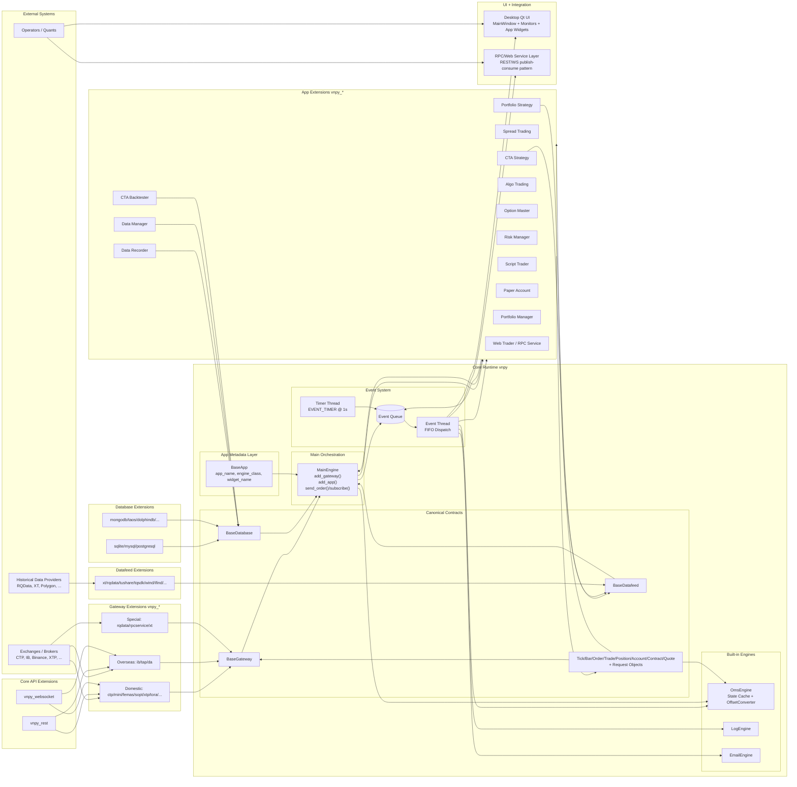

# Big Architecture Diagram (Core + Extensions)

This diagram shows how VeighNa runtime components and extension packages fit together.

## How Components Fit Together

1. `MainEngine` is the runtime hub.
   It boots built-in engines, loads gateway/app extensions, and routes trading API calls.

2. Gateways are the external boundary.
   Each gateway extension implements `BaseGateway` and converts broker payloads into canonical objects/events.

3. `EventEngine` is the system backbone.
   Gateways and apps publish events; the event thread dispatches them to OMS, apps, UI, and integration services.

4. `OmsEngine` is the in-memory source of truth.
   It maintains latest market/account/order/trade state and active orders/quotes for the whole process.

5. App extensions implement trading behavior.
   CTA/Spread/Portfolio/Algo/Option/Risk/etc. consume events and place/cancel orders through `MainEngine`.

6. Persistence is pluggable.
   Database adapters implement `BaseDatabase`; datafeed adapters implement `BaseDatafeed`; apps consume these interfaces without hard coupling.

7. UI and service integrations are subscribers.
   Desktop Qt widgets and RPC/Web layers react to the same event stream, keeping views aligned with engine state.
