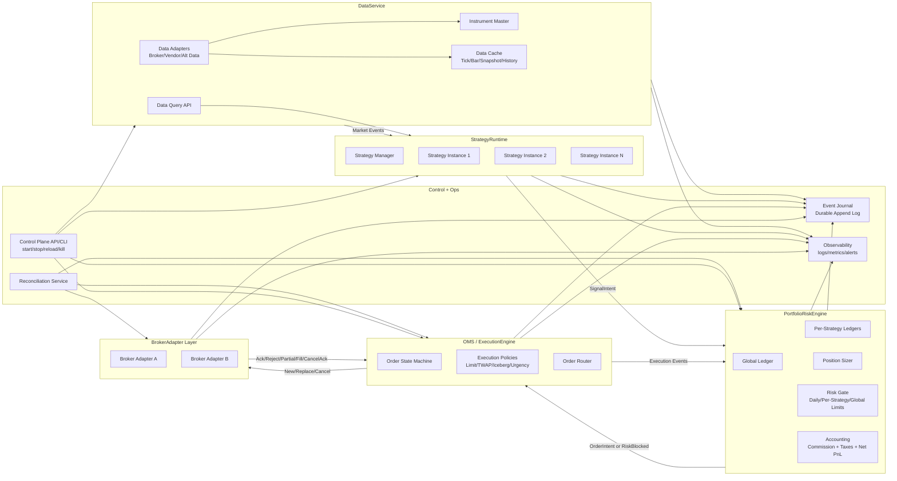

# Target Headless Architecture (Production Grade)

This document defines the target architecture for a headless, extensible trading system based on your expected model.

## Design Goals

- Headless first (no GUI dependency for core runtime).
- Strict component boundaries and ownership.
- Event-driven with deterministic order lifecycle.
- Extensible through plugin contracts (vnpy-style pip-install extensions).
- Production controls: reconciliation, journaling, kill switches, risk gates.

## Kernel vs Extensions (Architecture Rule)

Core codebase should remain a **small kernel**:
- canonical event schemas
- component interfaces/contracts
- runtime lifecycle and control hooks
- plugin loading/registry
- compatibility and contract-test framework

Strategy/use-case variations should live in **extensions**:
- use-case-specific data services (options multileg, multi-symbol portfolio, alt data)
- OMS variants (live broker OMS, paper OMS, backtest OMS)
- risk/sizer/execution policy packs
- strategy packs
- fee/tax models

This avoids kernel bloat and keeps maintenance boundaries clear.

## System Diagram



## Component Responsibilities

## DataService
- Ingest live/historical/alt data from adapters.
- Own instrument master and symbol metadata.
- Maintain queryable cache (last tick, bars, snapshots, calendars).
- Publish normalized market/domain events.

## StrategyRuntime
- Host multiple strategy instances with isolated context/state.
- Consume market/domain events; emit `SignalIntent` (not broker orders).
- Manage strategy lifecycle (init/start/stop/pause/reload).

## PortfolioRiskEngine
- Own funds, margin, holdings, exposure.
- Maintain per-strategy ledgers and global ledger.
- Convert signal intent -> sized/risk-checked order intent.
- Apply limits: per day, per strategy, per symbol, global.
- Perform accounting (commission/taxes/net PnL).

## OMS / ExecutionEngine
- Own canonical order state machine.
- Execute order intents via execution policies.
- Route orders to appropriate broker adapter.
- Handle lifecycle events (ack/reject/partial/fill/cancel/timeout/replace).

## BrokerAdapter
- Translate canonical requests/events to broker-specific APIs.
- Manage sessions, reconnect, heartbeat, and API throttles.
- Provide reconciliation endpoints for open orders/positions/balances.

## Control + Ops
- Headless control plane for operations.
- Reconciliation service to detect and heal state drift.
- Durable event journal for audit/recovery/replay.
- Observability and alerting.

## Authoritative Execution Flow

1. DataService publishes market event.
2. StrategyRuntime emits `SignalIntent`.
3. PortfolioRiskEngine determines quantity and checks limits.
4. Final risk gate evaluates current market + portfolio constraints.
5. If pass, produce `OrderIntent`; if fail, emit `RiskBlocked`.
6. OMS applies execution policy and sends broker action.
7. BrokerAdapter returns lifecycle events.
8. OMS updates state machine; PortfolioRiskEngine updates ledgers/accounting.

## Event Contracts (Canonical)

Required immutable event types:
- `SignalIntent`
- `OrderIntent`
- `OrderAccepted`
- `OrderRejected`
- `PartialFill`
- `Fill`
- `CancelAck`
- `RiskBlocked`
- `PositionUpdate`
- `LedgerEntry`

Required IDs (idempotency and traceability):
- `intent_id`
- `order_id`
- `broker_order_id`
- `fill_id`
- `strategy_id`
- `correlation_id`
- `causation_id`

## Plugin Contracts (Extensibility)

```python
class IDataAdapter:
    def connect(self) -> None: ...
    def subscribe(self, instruments: list[str]) -> None: ...
    def query_bars(self, symbol: str, n: int, timeframe: str) -> list: ...

class IStrategy:
    def on_event(self, event) -> list: ...  # emits SignalIntent(s)
    def on_control(self, cmd: str, payload: dict) -> None: ...

class ISizer:
    def size(self, signal_intent, portfolio_state, market_state): ...

class IRiskRule:
    def check(self, order_intent, portfolio_state, market_state) -> tuple[bool, str]: ...

class IExecutionPolicy:
    def plan(self, order_intent, market_state) -> list: ...  # child order actions

class IBrokerAdapter:
    def send(self, action) -> str: ...
    def cancel(self, broker_order_id: str) -> None: ...
    def snapshot(self) -> dict: ...  # open orders/positions/balances

class IFeeTaxModel:
    def compute(self, fill, account_context) -> dict: ...
```

## Extension Distribution and Discovery

Install model:
- extension packages are distributed independently and installed via `pip install`.
- kernel only references extension IDs in config.

Discovery model:
- use Python entry points for plugin registration/discovery.
- load plugins by capability + configured ID at startup.

Example entry-point groups:
- `tradingext.data_service`
- `tradingext.oms`
- `tradingext.strategy_runtime`
- `tradingext.risk_rule`
- `tradingext.sizer`
- `tradingext.execution_policy`
- `tradingext.fee_tax`
- `tradingext.broker_adapter`

## Compatibility and Contract Testing

Mandatory for every extension:
- declare supported kernel interface version(s)
- declare capability flags (for example: multi-leg atomic support, IOC/FOK support, options Greeks support)
- pass contract tests for implemented interface(s)

Kernel startup should reject incompatible extensions before runtime starts.

## Backtesting as Extension, Not Forked Core

Backtesting should reuse the same contracts:
- `DataServiceBacktest` implementation
- `OMSBacktest` implementation
- optional `BrokerAdapterSim` implementation

This ensures strategy/risk/portfolio logic remains portable across live and backtest runtimes.

## Non-Negotiable Production Controls

- Durable event journal with replay.
- Reconciliation loop (orders/positions/balances drift detection).
- Kill switches (global/strategy/symbol/venue).
- Data quality guards (stale/crossed/invalid quote checks).
- Idempotency on command and event ingestion.
- Backpressure handling and queue lag alarms.

## Scope and Boundary Rules

- StrategyRuntime does not call brokers directly.
- PortfolioRiskEngine owns sizing and risk decisions.
- OMS owns order state transitions and broker command execution.
- Accounting owns commission/tax/net PnL computations.
- All cross-component communication uses canonical events.

## Incremental Delivery Plan

1. Build canonical event schema + IDs + journal.
2. Implement OMS state machine + broker adapter contract.
3. Add PortfolioRiskEngine ledgers + sizing + risk gate.
4. Wire StrategyRuntime multi-instance manager.
5. Add reconciliation + control plane + alerts.

## See Also

- Runtime details: `docs/architecture/PYTHON_RUNTIME_EXECUTION_MODEL.md`
